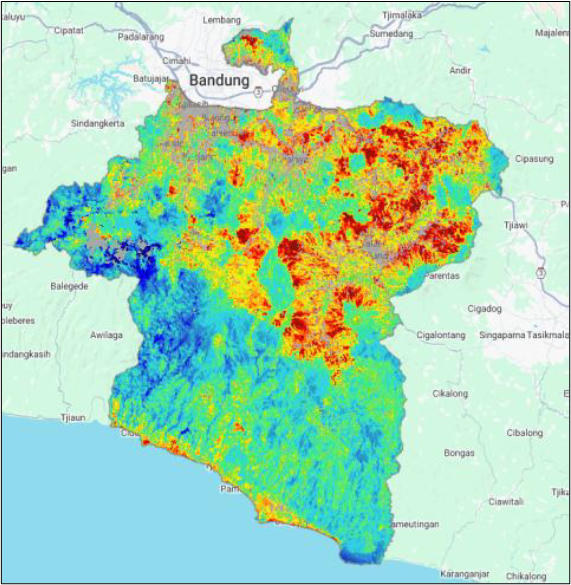
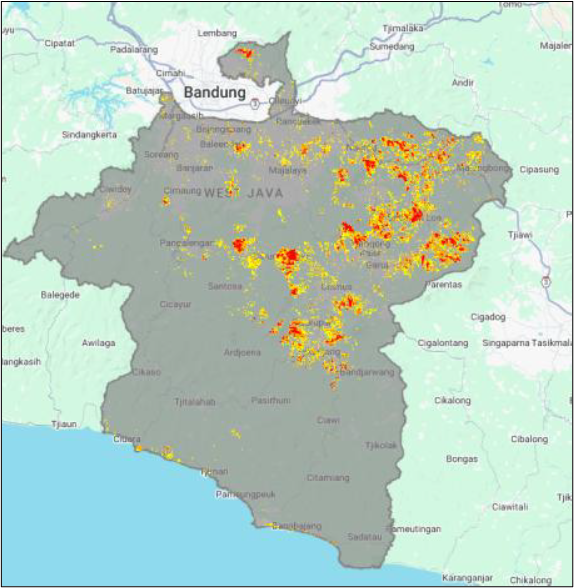

# GEE_Geothermal_Detection

**Automated Google Earth Engine script for geothermal potential detection.**
Leverages Landsat 8 LST, geological data, and an automated workflow. Features: cloud/water/urban masking, Mono-Window LST, topographic correction, global threshold anomaly detection, and a scoring system based on LST anomalies and fault proximity. Includes annual LST trend analysis. Adaptable and efficient for geothermal exploration.

## Table of Contents
- [Introduction](#introduction)
- [Key Features](#key-features)
- [How to Use](#how-to-use)
  - [Prerequisites](#prerequisites)
  - [GEE Asset Setup](#gee-asset-setup)
  - [Script Parameters](#script-parameters)
  - [Running the Script](#running-the-script)
- [Script Structure](#script-structure)
- [Example Outputs](#example-outputs)
- [License](#license)
- [Contact](#contact)

## Introduction

This repository contains an automated Google Earth Engine (GEE) script designed for the detection and scoring of geothermal potential hotspots. By analyzing Land Surface Temperature (LST) derived from Landsat 8 imagery and integrating geological fault data, this script provides a comprehensive and adaptable methodology for identifying areas indicative of geothermal activity. It's particularly useful for preliminary geothermal exploration and environmental monitoring.

## Key Features

* **Automated Data Acquisition & Pre-processing:** Seamlessly acquires and pre-processes Landsat 8 Level-2 Surface Reflectance and Surface Temperature data from 2017 to 2023.
* **Environmental Filtering:** Applies filters for optimal conditions, including a specified rainy season period (October to April) and a cloud cover threshold below 10%.
* **Systematic Masking:** Implements systematic masking to remove unwanted features such as clouds (using the `QA_PIXEL` band), water bodies (using MNDWI), and urban areas (leveraging Copernicus Land Cover data).
* **LST Calculation:** Computes Land Surface Temperature (LST) using the Mono-Window Algorithm, derived from Landsat 8's thermal band (`ST_B10`) and emissivity calculated from NDVI.
* **Topographic Correction:** Incorporates topographic correction based on SRTM Digital Elevation Model (DEM) data to account for elevation-induced temperature variations, improving LST accuracy.
* **Anomaly Detection:** Utilizes a global threshold statistical analysis based on the mean and standard deviation of the long-term average LST to identify weak, medium, and strong thermal anomalies.
* **Geothermal Potential Scoring:** Implements a scoring system that combines the strength of thermal anomalies (Score 1: Hotspot) with proximity to geological fault zones (Score 2: Overlap Hotspot & Fault, using a user-defined buffer distance).
* **Annual LST Trend Analysis:** Generates an interactive chart displaying the annual average LST trend over the study period, aiding in temporal analysis.
* **Methodological & Adaptable:** Designed as a methodological product, the script is structured for easy adaptation to other study areas by simply modifying region-of-interest and geological asset paths.

## How to Use

Follow these steps to run the script in your Google Earth Engine environment:

### Prerequisites

* A Google Earth Engine account.
* Access to the GEE Code Editor (`https://code.earthengine.google.com`).

### GEE Asset Setup

This script relies on specific `FeatureCollection` and `Image` assets stored in Google Earth Engine. **You will need to upload your own spatial data (e.g., shapefiles for your region of interest, fault lines, or GWA areas) as assets to your GEE account and update the paths in the script.**

1.  **Upload Your Assets:**
    * In the GEE Code Editor, go to the "Assets" tab (left panel).
    * Click "NEW" and select "Shape files" for vector data (e.g., `.shp`, `.shx`, `.dbf`, `.prj`) or "Image files" for raster data (e.g., `.tif`).
    * Follow the prompts to upload your data. Remember the asset ID (e.g., `users/your_username/your_asset_name`).

2.  **Update Script Paths:**
    * Open the `GEE_Geothermal_Detection.js` file.
    * Navigate to **"BAGIAN 1: PARAMETER YANG DAPAT DIUBAH (DISESUAIKAN DENGAN DATA USER)"**.
    * Modify the `ee.FeatureCollection` and `ee.Image` paths to point to your newly uploaded assets.

    ```javascript
    // Example: Update these paths
    var regionOfInterest = ee.FeatureCollection('users/your_username/your_asset_name'); // CHANGE THIS
    var faultData = ee.FeatureCollection('users/your_username/your_asset_name');       // CHANGE THIS
    var wkpData = ee.FeatureCollection('users/your_username/your_asset_name');           // CHANGE THIS

    // If you use validation TIFs:
    var image1 = ee.Image("users/your_username/your_asset_name"); // CHANGE THIS
    // ...and so on for image2, image3
    ```

### Script Parameters

Adjust the following parameters in **"BAGIAN 1: PARAMETER YANG DAPAT DIUBAH"** within the script to fit your study area and analytical needs:

* `startDate` & `endDate`: Define the temporal range for Landsat 8 imagery analysis (e.g., `'2017-01-01'`, `'2023-12-31'`).
* `seasonFilter`: Adjust the rainy season months (e.g., `ee.Filter.calendarRange(10, 4, 'month')` for October to April).
* `cloudCoverThreshold`: Set the maximum allowed cloud cover percentage for Landsat imagery (e.g., `10`).
* `faultBufferDistance`: Define the buffer distance (in meters) around fault lines for scoring (e.g., `1000`).
* `weakAnomalyMultiplier`, `mediumAnomalyMultiplier`, `strongAnomalyMultiplier`: Set the standard deviation multiples for defining different levels of LST anomalies (e.g., `1.5`, `2.0`, `2.5`).

### Running the Script

1.  **Open the Script:** Copy the entire content of `GEE_Geothermal_Detection.js` and paste it into a new script in your GEE Code Editor.
2.  **Update Asset Paths & Parameters:** As described above, ensure all asset paths and analysis parameters are correctly set for your study.
3.  **Run:** Click the "Run" button in the GEE Code Editor.

**Expected Output:**
* **Map View:** The map will display:
    * The mean LST map for your region of interest.
    * Optional layers for Weak, Medium, and Strong LST Anomalies.
    * Buffer Zone around Faults.
    * **Score 1: Hotspot** layer (strong LST anomalies).
    * **Score 2: Overlap Hotspot & Fault** layer (areas with strong LST anomalies overlapping fault buffers).
* **Console Tab:** The console will output:
    * Regional LST statistics (mean, standard deviation).
    * Calculated anomaly thresholds.
    * General information, including local lapse rate and reference elevation.
    * Minimum and Maximum LST from the mean LST map.
    * An interactive chart showing the **Annual Mean LST Trend** over your study period.

## Script Structure

The script is logically organized into several sections for clarity and ease of modification:

* **BAGIAN 1: PARAMETER YANG DAPAT DIUBAH:** User-definable parameters for the study region, geological data, analysis period, and scoring thresholds.
* **BAGIAN 2: PENYIAPAN PETA DAN VISUALISASI AWAL:** Initializes the map view and adds initial layers (study region, faults, GWA, and optional validation TIFs).
* **BAGIAN 3: FUNGSI-FUNGSI UTAMA UNTUK PEMROSESAN CITRA:** Contains core functions for Landsat 8 preparation (scaling, cloud masking), water masking (MNDWI), urban masking (Copernicus Landcover), LST calculation (Mono-Window), and elevation correction.
* **BAGIAN 4: PEMROSESAN DATA UTAMA & PERHITUNGAN LST:** Orchestrates the application of processing functions to the Landsat 8 collection, performs elevation correction, and generates the final mean LST map and annual LST collection.
* **BAGIAN 5: DETEKSI ANOMALI & SKORING:** Calculates regional LST statistics, defines anomaly thresholds, creates anomaly layers, and computes the geothermal potential scores. It also prints key information to the console.
* **BAGIAN 6: VISUALISASI HASIL AKHIR PADA PETA:** Defines visualization parameters and adds all result layers to the GEE map.
* **BAGIAN 7: GRAFIK STATISTIK TAHUNAN:** Generates the annual LST trend chart for temporal analysis.

## Example Outputs

Here are some example outputs from running the script:

### 1. Mean Land Surface Temperature (LST) Layer After Topographic Correction
This map displays the average LST in the study area after topographic correction, which serves as the basis for anomaly detection.


*Caption: Average Land Surface Temperature over the study period in the research area.*

### 2. Thermal Anomaly Level Layer Based on Multiples of Standard Deviation
This map identifies areas with significantly higher surface temperatures than the average, which are interpreted as potential geothermal hotspots.


*Caption: A visualization of thermal hotspots (positive temperature anomalies) identified by the script.*

### 3. Geothermal Potential Layer (Anomaly With Faults & GWA Overlap)
This is the most critical final output, where hotspot areas are combined with geological fault buffers to assign a higher geothermal potential score.


*Caption: Areas with a high geothermal potential score, indicating an overlap between thermal anomalies with geological fault lines and Geothermal Working Area.*

### 4. Annual Land Surface Temperature (LST) Trend Chart
This chart shows how the average LST changes from year to year in the study area, providing a temporal context for the spatial analysis.


*Caption: Annual mean LST trend within the defined region of interest.*

## License

This project is licensed under the [MIT License](LICENSE).

## Contact

For any questions or inquiries, please feel free to contact:

* **Farrel Nugroho**
* [farrelnugroho40@gmail.com]
* [https://scholar.google.com/citations?hl=en&user=tYurMxsAAAAJ]
